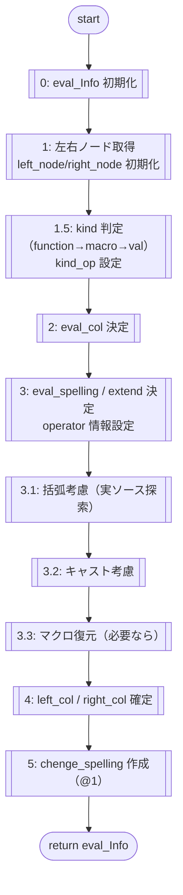

<!--
NOTE:
この変更は「各関数セクションの冒頭に mermaid フローチャートを置く」形で追記する想定。
既存本文は保持し、先頭側に “フロー（mermaid）” 小見出しを追加する。
-->

# all_AST関数 / func_walk関数 仕様

all_AST関数, func_walk関数を次の通りに作成すること。

---

## analyzeInfo（解析対象情報）

analyzeInfoは以下の情報が入る。

**analyzeInfo（例）**
```json
{
  "line": 10,
  "data": {
    "col": 9,
    "analizeID": "A-001",
    "op": {
      "operator": "+",
      "operator_exitcolnum": 2
    }
  }
}
```

### 入力形式（確定：ずれ吸収）
- analyzeInfo の必須構造は **上記 JSON の通り**（`data` ネストを前提）とする。
- `line` / `data.col` / `data.op.operator_exitcolnum` は **数値**。
- `data.op.operator_exitcolnum` は「同じ演算子がその行に複数あるとき、左から何個目か（1始まり）」。

---

## all_AST関数

### フロー（mermaid：確定版）
```mermaid
flowchart TD
  S([start]) --> I0[[0: 初期化<br/>macroTable=[]]]
  I0 --> M1[[1: macroTable を収集（TU直下）]]
  M1 --> W2{2: TU全体を走査（preorder）}
  W2 -->|node| L3{3: node の (file,line) が (src_file, analyzeInfo.line) と一致?}
  L3 -->|No| W2
  L3 -->|Yes| C4[[4: func_walk(node, analyzeInfo, macroTable)]]
  C4 --> RET([return func_walk の返り値])
```

### [3] 解析対象行の一致条件（確定：file一致必須）
- 行番号のみ一致は不可（SDKヘッダ等の同一行番号を誤検出するため）。
- 一致判定は次を満たすこと：
  - `abs(node.file) == abs(src_file)`
  - `node.line == analyzeInfo.line`

### [1] 走査範囲（確定：TU直下のみ禁止）
- 解析対象式は関数内ステートメント等であり TU 直下に出ない場合があるため、
  `tu.cursor.get_children()` のみの走査は禁止。
- `tu.cursor.walk_preorder()` 等で **TU全体**を走査してよい（推奨）。

---

## func_walk関数

### フロー（mermaid：確定版）
```mermaid
flowchart TD
  S([start]) --> I0[[0: 初期化<br/>candidates=[]]]
  I0 --> P1[[1: macroLineData_pre = makeLineMacroData_pre(pre_line, macroTable)]]
  P1 --> T2{2: child を1回走査}
  T2 -->|Binary/CompoundAssign| OP{3: node自身の演算子 == analyzeInfo.data.op.operator ?}
  OP -->|No| T2
  OP -->|Yes| COL{4: operator_col を tokenize で取得できる?}
  COL -->|No| T2
  COL -->|Yes| IN{5: operator_col がマクロ領域(pre)内?}
  IN -->|Yes| T2
  IN -->|No| ADD[[候補追加 (cursor,col)]]
  ADD --> T2
  T2 --> DONE[[6: col 昇順ソート→operator_exitcolnum 番目を採用]]
  DONE --> N7{target あり?}
  N7 -->|No| R0[[空の eval_datas で返す]] --> RET([return r])
  N7 -->|Yes| G8[[getTargetInfo(target_data, line, macroTable)]] --> RET
```

### 引数
- <1> クラス内の変数（self）
- <2> AST子ノード（child）
- <3> 解析対象情報（analyzeInfo）
- <4> マクロテーブル（macroTable）

### 返り値
- all_AST関数の返り値と同じ

---

## func_walk関数（内容）

start

### [0] 初期化
- 対象演算子の cursor ノード候補変数リストを **空リスト `[]`** で初期化する。

cursorノード候補変数リスト（定義）：

```json
[
  {
    "operator": "演算子",
    "data": [
      { "child": "cursorノード", "col": "列番号（実ソースベース）" }
    ]
  }
]
```

### [1] makeLineMacroData を実行し、macroLineData を取得する

---

## makeLineMacroData関数

### フロー（mermaid）
```mermaid
flowchart TD
  S([start]) --> I0[[初期化<br/>results=[]<br/>pre_col=0<br/>post_col=0]]
  I0 --> W1{while: pre_col/post_col が末尾でない}
  W1 --> CMP{pre_line[pre_col] == post_line[post_col] ?}
  CMP -->|Yes| INC[[pre_col++, post_col++]] --> W1
  CMP -->|No| EX3[[3: pre_line から macro 名抽出<br/>区切り文字で終端判定]]
  EX3 --> FIND{macroTable に存在?}
  FIND -->|No| ERR[[例外/終了（try-catch）]] --> E([end])
  FIND -->|Yes| R4[[4: r_data 作成<br/>post_col_start = post_col + 1]]
  R4 --> K5{5: macro kind は?}
  K5 -->|object macro| SOBJ[[post_line から macro_val と一致する範囲探索<br/>一致末尾→post_col_end]]
  K5 -->|function macro| SFN[[括弧バランスで範囲確定<br/>見つからなければ区切りまで]]
  SOBJ --> ADD[[6: r_data に post_col_end を追加<br/>results に追加]]
  SFN --> ADD
  ADD --> INC2[[7: pre_col++, post_col++]] --> W1
  W1 -->|終了| RET([return results])
```

### 引数
- <1> プリプロセス前の行のコード文字列（pre_line）
- <2> プリプロセス後の行のコード文字列（post_line）
- <3> マクロテーブル（macroTable）

### 返り値
行番号ポストマクロテーブル（macroLineData）：

```json
[
  {
    "macro_name": "マクロ名称",
    "post_col_start": "postベースで何列目から展開済み領域が始まるか（1始まり）",
    "post_col_end": "postベースで何列目まで展開済み領域が続くか（1始まり）"
  }
]
```

### 内容（シーケンス）

start

- results（返り値用の空リスト）を作成
- pre_col（探索用列番号）= 0（0始まりのインデックスとして扱う）
- post_col（探索用列番号）= 0（0始まりのインデックスとして扱う）

※注意：pre_col/post_col は「内部処理用の0始まりインデックス」でよいが、返す `post_col_start/end` は **1始まり列**に変換すること。

[1] while で回す  
「pre_colがpre_lineの末尾」または「post_colがpost_lineの末尾」に来たら終了する。

[2] pre_line[pre_col] と post_line[post_col] の一致を確認する。  
不一致の場合 [3] を実行する。

[3] 不一致の場合、pre_line からマクロ名を抽出する。  
- 終端は「空白」ではなく**区切り文字**で判定する。
  - 空白類：`' '` `'\t'`
  - 記号類：`)` `(` `;` `,` `+` `-` `*` `/` `%` `&` `|` `^` `!` `~` `<` `>` `=` `?` `:` `[` `]` `{` `}`
- 上記のいずれかが出た時点でマクロ名を確定し、それを `target_macro` とする。
- target_macro が macroTable にあるか探索する。
- 見つからない場合は異常として終了（try/catch を実装）。

[4] r_data を作成し、以下を代入する（列は postベース1始まりで保持）：

```json
{ "macro_name": "target_macro", "post_col_start": "post_col + 1" }
```

[5] `post_col_end` の決定（val_length を使わない）
- `target_macro` が **オブジェクトマクロ**の場合：
  - `post_line` の `post_col` 位置から、`macroTable[target_macro].val` と一致する最初の範囲を探索し、
    その一致末尾を `post_col_end` とする。
- `target_macro` が **関数マクロ**の場合：
  - `post_col` 位置から、最初に `(` を見つけたら括弧深さを +1、`)` で -1 し、
    深さが 0 に戻った位置を末尾として `post_col_end` を決める。
  - もし `(` が見つからない場合は、次の区切り（空白や `; , )` など）までを範囲として `post_col_end` を決める。

[6] r_data に `post_col_end`（postベース1始まり）を追加し results に加える。

[7] pre_col と post_col をインクリメントして探索を継続する。

[8] results を返却する

end

---

## func_walk（続き）

### [2] child を1回だけ走査し、cursor候補を収集する
- 二重走査はしない。
- `child` を展開し、以下を満たす BinaryOperator を候補として追加する。

### [3] child が2項演算子（BinaryOperator）の場合
[3.1] child の演算子が analyzeInfo["data"]["op"]["operator"] と一致する場合に [3.2]。

[3.2] child の列番号が macroLineData のいずれかの範囲に含まれるかを判定する。  
- 含まれる場合：スキップ（候補に入れない）
- 含まれない場合：cursorノード候補変数リストに追加する

追加構造：

```json
[
  {
    "operator": "childの演算子",
    "data": [
      { "child": "cursorのノード", "col": "列番号（実ソースベース）" }
    ]
  }
]
```

### [4] target_cursor を確定する（走査後）
- cursorノード候補変数リストから、analyzeInfo の operator と一致する要素を取得する。
- 取得した data を col 昇順でソートする。
- `operator_exitcolnum`（1始まり）の位置の要素を選択し、それを `target_cursor` とする。
- data のサイズが operator_exitcolnum 未満の場合は `target_cursor=None` とする。

### [5] target_cursor が取得できない場合
- 返り値は **常に all_AST と同じ辞書形式**を返し、`eval_datas=[]` とする。

### [6] target_cursor が取得できた場合
getTargetInfo(target_data, line, macroTable) を実行する。

---

## getTargetInfo関数

### フロー（mermaid）


### 引数
- <1> `{ "child": "cursorノード", "col": "列番号（実ソースベース）" }`
- <2> 行数
- <3> マクロテーブル

### 返り値
all_AST の返り値の eval_datas の 1要素に当たるデータ（eval_Info）

（構造は前述の返り値定義に従う）

### 内容（シーケンス）

start

### [0] eval_Info を初期化する。

### [1] 左右ノードを取得する（初期化内容の更新）
対象の BinaryOperator cursor を `cursor` とする。

- `children = list(cursor.get_children())`
- `child1 = children[0]`
- `child2 = children[1]`
- `left_node  = child1`
- `right_node = child2`

※ right_node/left_node は「変数」に限定せず、**式ノード**として扱う。

この時、eval_Info に以下を入れる（初期値を含む）：

- left_val_spelling = left_node.spelling
- left_val_cursor_head = left_node
- left_val_kind = "val"（後で確定）
- left_kind_op = null（後で確定）
- left_col = 0（後で更新）
- left_spel_insert_id = 1（簡略ルールで常に1）

- right_val_spelling = right_node.spelling
- right_val_cursor_head = right_node
- right_val_kind = "val"（後で確定）
- right_kind_op = null（後で確定）
- right_col = 0（後で更新）
- right_spel_insert_id = 1（簡略ルールで常に1）

### [1.5] left_val_kind/right_val_kind と kind_op を確定する（新）
- childノード（left/right の cursor_head）から **関数呼び出しか**を判定し、該当すれば kind を `"function"` とする。
- 次に、macroTable と実ソース行の文字列から **マクロに該当するか**を判定し、該当すれば kind を `"macro"` とする。
- いずれでもなければ `"val"` とする。

kind_op の設定：
- kind=`val`：`*_kind_op = null`
- kind=`macro`：`*_kind_op = [{ "macro_name": "<name>", "macro_val": "<val>" }]`
- kind=`function`：`*_kind_op = "funcName(arg1, arg2, ...)"`

### [2] eval_col を決定する
- cursorノードから演算子の列数（実ソースベース/1始まり）を求めて代入する。

### [3] eval_spelling / eval_spelling_extend を決定する
- "左辺文字列" + "演算子文字列" + "右辺文字列" のスペルを入れる。
  - 左辺：left_node.spelling
  - 右辺：right_node.spelling
  - 演算子：引数<1>.child.spelling

同時に以下も代入する：
- operator_spelling = 引数<1>.child.spelling
- operator_cursor = 引数<1>.child
- operator_col = 引数<1>.col
- left_val_spelling / right_val_spelling は基本 left/right node の spelling

### [3.1] 式に括弧が付いている場合は括弧も含める
例：`(a + b)` なら `(a + b)` とする。  
括弧の有無は eval_spelling を使わず、実ソース（プリプロセス前）該当行の文字列を列起点に探索して判定する。

### [3.2] 既にキャストが入っている式はキャスト込みで保持する
例：`(int)a + b` なら `(int)a + b` とする。

### [3.3] マクロが含まれる場合はマクロ名に戻す
eval_Info の以下を更新対象とする：
- eval_spelling
- left_val_spelling
- right_val_spelling

復元は、実ソースの該当行・列を起点にし、macroTable と makeLineMacroData を用いて行う。

### [4] left_col / right_col を確定する
- left_col/right_col は実ソース該当行で left/right の spelling の開始位置（列/1始まり）を求めて代入する。
- キャストが入っている場合、開始列はキャストの "(" の位置から数える。

### [5] chenge_spelling の仕様（簡略）
- chenge_spelling は「spelling の一部を @1 に置換した文字列」とする。
- `@1` は置換対象の部分式を表す。

例：
- spelling: `a = b + c + d - e;`
- `@1` が表す部分式：`b + c`
- chenge_spelling: `a = @1 + d - e;`

`chenge_spelling` に `@1` を適用すると、元の spelling に復元されるイメージとする。

### [6] left_val_kind_opstr / right_val_kind_opstr を決定する
CursorKind の分類に応じて補助文字列を付けてよい（空でも可）。

### [7] eval_Info を返却する

end

---

## func_walk（返り値の作成）

### [8] 返り値 r を構成する

```json
{
  "analizeID": "analyzeInfo[\"data\"][\"analizeID\"] の値",
  "line": "analyzeInfo[\"line\"]",
  "spelling": "対象行（プリプロセス前）の生文字列",
  "chenge_spelling": "spelling の一部を @1 に置換した文字列",
  "eval_datas": []
}
```

### [9] target_cursor が取得できた場合
- getTargetInfo(target_data, line, macroTable) を実行し、
  返り値 eval_Info を `r["eval_datas"]` に append する。
- analyzeInfo["data"] は単一要素であるため、eval_datas は 0件または1件となる。

### [10] r を返却する

end

---

## all_AST（spelling/chenge_spelling の補足）

### [5] all_AST は func_walk の返り値をそのまま返却する

ただし、all_AST 自体が spelling を作る必要がある場合：

- spelling は「プリプロセス前の実ソース」の対象行文字列
- chenge_spelling は spelling に対して置換を適用した文字列

### [6] 例外処理方針
- マクロ復元ができない（macroTable に存在しない等）：
  - try/catch で握り、復元せず展開後文字列のまま続行してよい。
- operator_exitcolnum が範囲外：
  - eval_datas に追加しない（スキップ）。
  - 返り値自体は空の eval_datas を持った辞書として返してよい。

end

---

## 出力例（analyzeInfo の構造に合わせた例）

入力（analyzeInfo）：

```json
{
  "line": 10,
  "data": {
    "col": 9,
    "analizeID": "A-001",
    "op": {
      "operator": "+",
      "operator_exitcolnum": 2
    }
  }
}
```

対象ソース（例）：

```
10: a = b + c + d - e;
```

説明：
- operator="+" が行内に複数ある場合、
  operator_exitcolnum=2 は「左から2個目の +」（`c + d`）を対象にする。

返り値例（辞書型データ）：

```json
{
  "analizeID": "A-001",
  "line": 10,
  "spelling": "a = b + c + d - e;",
  "chenge_spelling": "a = @1 + d - e;",
  "eval_datas": [
    {
      "eval_col": 13,
      "eval_spelling": "c + d",
      "eval_spelling_extend": "c + d",
      "operator_spelling": "+",
      "operator_cursor": "<Cursor>",
      "operator_col": 13,

      "left_val_spelling": "c",
      "left_val_cursor_head": "<Cursor>",
      "left_val_kind": "val",
      "left_kind_op": null,
      "left_col": 11,
      "left_spel_insert_id": 1,

      "right_val_spelling": "d",
      "right_val_cursor_head": "<Cursor>",
      "right_val_kind": "val",
      "right_kind_op": null,
      "right_col": 15,
      "right_spel_insert_id": 1
    }
  ]
}
```

---

### 例2：複雑なマクロ（オブジェクトマクロ＋ネスト＋括弧）

入力（analyzeInfo）：

```json
{
  "line": 20,
  "data": {
    "col": 1,
    "analizeID": "A-002",
    "op": {
      "operator": "+",
      "operator_exitcolnum": 1
    }
  }
}
```

対象ソース（例）：

```c
#define BASE     (1U)
#define SCALE(x) ((x) * 4U)
#define COMPLEX  (BASE + SCALE(3U))
20: uint32_t r = COMPLEX + v;
```

返り値例：

```json
{
  "analizeID": "A-002",
  "line": 20,
  "spelling": "uint32_t r = COMPLEX + v;",
  "chenge_spelling": "uint32_t r = @1;",
  "eval_datas": [
    {
      "eval_col": 22,
      "eval_spelling": "COMPLEX + v",
      "eval_spelling_extend": "COMPLEX + v",
      "operator_spelling": "+",
      "operator_cursor": "<Cursor>",
      "operator_col": 22,

      "left_val_spelling": "COMPLEX",
      "left_val_cursor_head": "<Cursor>",
      "left_val_kind": "macro",
      "left_kind_op": [
        { "macro_name": "COMPLEX", "macro_val": "(BASE + SCALE(3U))" }
      ],
      "left_col": 14,
      "left_spel_insert_id": 1,

      "right_val_spelling": "v",
      "right_val_cursor_head": "<Cursor>",
      "right_val_kind": "val",
      "right_kind_op": null,
      "right_col": 24,
      "right_spel_insert_id": 1
    }
  ]
}
```

---

### 例3：関数が入り混じる（その1：引数内の演算子）

入力（analyzeInfo）：

```json
{
  "line": 30,
  "data": {
    "col": 1,
    "analizeID": "A-003",
    "op": {
      "operator": "+",
      "operator_exitcolnum": 1
    }
  }
}
```

対象ソース（例）：

```c
30: int y = foo(a + b) + bar(c);
```

返り値例：

```json
{
  "analizeID": "A-003",
  "line": 30,
  "spelling": "int y = foo(a + b) + bar(c);",
  "chenge_spelling": "int y = foo(@1) + bar(c);",
  "eval_datas": [
    {
      "eval_col": 15,
      "eval_spelling": "a + b",
      "eval_spelling_extend": "a + b",
      "operator_spelling": "+",
      "operator_cursor": "<Cursor>",
      "operator_col": 15,

      "left_val_spelling": "a",
      "left_val_cursor_head": "<Cursor>",
      "left_val_kind": "val",
      "left_kind_op": null,
      "left_col": 13,
      "left_spel_insert_id": 1,

      "right_val_spelling": "b",
      "right_val_cursor_head": "<Cursor>",
      "right_val_kind": "val",
      "right_kind_op": null,
      "right_col": 17,
      "right_spel_insert_id": 1
    }
  ]
}
```

---

### 例4：関数が入り混じる（その2：トップレベルの演算子）

入力（analyzeInfo）：

```json
{
  "line": 31,
  "data": {
    "col": 1,
    "analizeID": "A-004",
    "op": {
      "operator": "+",
      "operator_exitcolnum": 2
    }
  }
}
```

対象ソース（例）：

```c
31: int y = foo(a + b) + bar(c);
```

返り値例：

```json
{
  "analizeID": "A-004",
  "line": 31,
  "spelling": "int y = foo(a + b) + bar(c);",
  "chenge_spelling": "int y = @1;",
  "eval_datas": [
    {
      "eval_col": 20,
      "eval_spelling": "foo(a + b) + bar(c)",
      "eval_spelling_extend": "foo(a + b) + bar(c)",
      "operator_spelling": "+",
      "operator_cursor": "<Cursor>",
      "operator_col": 20,

      "left_val_spelling": "foo(a + b)",
      "left_val_cursor_head": "<Cursor>",
      "left_val_kind": "function",
      "left_kind_op": "foo(a, b)",
      "left_col": 9,
      "left_spel_insert_id": 1,

      "right_val_spelling": "bar(c)",
      "right_val_cursor_head": "<Cursor>",
      "right_val_kind": "function",
      "right_kind_op": "bar(c)",
      "right_col": 22,
      "right_spel_insert_id": 1
    }
  ]
}
```

---

## 例1〜4の再現性を担保するための仕様（決定事項）

本仕様の目的は、例1〜4のようなケースで **同一入力に対して常に同一出力**になるよう、曖昧な決定点（列・出現順・kind判定・@1置換）を仕様として確定することである。  
以降、本節の定義は本文の該当箇所より優先される。

---

## 行・列・出現順の基準（追記・確定）

- 列番号（`col`）は **実ソースベース / 1始まり** とする。
- `operator_exitcolnum` は「**当該行（実ソース）の左から見たとき**、対象 `operator` が **何回目に出現するか（1始まり）**」を表す。

---

## func_walk関数（追記・確定ルール）

### 目的（追記）
`analyzeInfo.data.op.operator` と `operator_exitcolnum` により、当該行に複数存在する同一演算子のうち **どの演算子箇所が解析対象か**を一意に特定する。

### 対象ノード種別（追記）
本仕様における「演算子対象ノード」は、少なくとも以下を含む：
- `BinaryOperator`
- `CompoundAssignOperator`（`+=` 等）

（必要に応じて `ConditionalOperator` 等を追加してよいが、その場合は `operator_spelling` と列算出規則を同様に定義すること。）

### 候補 `col` の定義（確定）
`func_walk` が保持する候補データの `col` は、次を指す：

- `col` = **演算子トークン（operator_spelling）の列（実ソースベース / 1始まり）**

（注）式の開始位置や左オペランドの開始位置ではない。

### `col`（= operator_col）の取得方法（確定）
候補演算子の `operator_col` は次の手順で求める：

1. 対象行の実ソース文字列を `spelling` とする。
2. 対象ノードの左右ノード（left/right）に対し、実ソース上の `left_col` / `right_col` を求める  
   （列確定ロジックは `getTargetInfo` の「left_col/right_col の確定」と同一でよい）。
3. `spelling` の **left側の末尾〜right側の先頭の間**の範囲を走査し、`operator_spelling` が最初に出現した位置を `operator_col` とする。
4. `operator_col` を候補 `col` として保持する。

走査における注意（誤検出防止）：
- 走査範囲内の **コメント**（`/* ... */`、`// ...`）はスキップする。
- 走査範囲内の **文字列/文字リテラル**（`"..."`、`'...'`）はスキップする。  
（上記が困難な想定の場合は tokenize を採用し、「演算子トークン列」から取得してもよい。ただし採用方式は実装方針として固定すること。）

複数文字演算子：
- `<<` `>>` `<=` `>=` `==` `!=` `&&` `||` などは **文字列一致**で判定する。

### operator_exitcolnum の適用（確定）
- `operator_spelling` が一致する候補のみ収集する。
- 収集候補に対し、後述の「マクロ領域除外（実ソースベース）」を適用し、除外対象を落とす。
- 残った候補を `col` 昇順にソートし、`operator_exitcolnum` 番目（1始まり）を `target_cursor` として確定する。

例：
- `x = a + (b + c);` の `+` の1個目は **`a` の右の `+`** を指す。

---

## マクロ領域除外（列基準の混在解消：確定）

従来仕様では、マクロ領域テーブル（macroLineData）が `post_col_start/end`（postベース列）であり、`func_walk` の候補 `col`（実ソース列）と直接比較できない問題がある。  
本仕様では「除外判定」を **実ソースベース列**に統一する。

### macroLineData_pre（新規定義）
`makeLineMacroData_pre` は以下を返す。

```json
[
  {
    "macro_name": "マクロ名称",
    "pre_col_start": "実ソースベースで開始列（1始まり）",
    "pre_col_end": "実ソースベースで終了列（1始まり）"
  }
]
```

- 除外判定は `pre_col_start <= operator_col <= pre_col_end` のみを使う。
- postベースの `post_col_start/end` は **除外判定に使わない**（列基準がズレるため）。

---

## getTargetInfo（追記：処理順の確定）

### 処理順（確定）
1. left/right ノード取得
2. tokenize で `left_col/right_col` と `operator_col` を確定（実ソース/1始まり）
3. kind判定（function → macro → val）
4. `eval_spelling/eval_spelling_extend` 確定
5. `chenge_spelling` を `@1` 置換で生成（失敗時フォールバックあり）

---

## 仕様反映（追加問題点A〜Eの解消：確定ルール）

本節は、追加で判明した問題点A〜E（left/right列確定、operator探索範囲、最長一致、コメント/文字列、対象ノード不足）を解消し、仕様の決定性と実装可能性を担保するための **仕様確定**である。  
以降、本節の定義は本文の該当箇所より優先される。

---

## A：`left_col/right_col` の確定方法（確定：tokenize必須）

`left_col/right_col` は **tokenize した token の begin/end** により求める（tokenize採用必須）。

### 定義
- `left_col`：left式を構成するトークン列の **先頭トークン begin列**（実ソースベース/1始まり）
- `left_end_col`：left式を構成するトークン列の **末尾トークン end列**
- `right_col`：right式を構成するトークン列の **先頭トークン begin列**
- `right_end_col`：right式を構成するトークン列の **末尾トークン end列**

（注）従来の `left_col/right_col` が「開始列」しか持たない実装の場合、必要に応じて `*_end_col` を内部的に保持してよい。

### 取得不能時の扱い（確定）
- tokenizeが失敗、または対象ノード範囲のtokenが取得できない場合は、その評価（eval_Info）について
  - `eval_datas` への追加を行わず（または `unsupported` として扱い）、呼び出し元は空結果として扱う。
  - 例外でプロセスを停止しない（解析継続を優先）。

---

## B：`operator_col` 探索範囲（確定：tokenizeで一意化）

`operator_col` は「文字列スキャン」ではなく、tokenize結果から一意に求める（tokenize採用必須）。

### 定義（確定）
- `operator_col` は、対象ノード（BinaryOperator 等）の token 列のうち、
  **operator_spelling と一致する演算子トークン**の begin列とする。

### 探索範囲（確定）
- 探索対象 token は、対象ノード（BinaryOperator/CompoundAssignOperator 等）の extent に含まれる token 列とする。
- その token 列の中で、`operator_spelling` と一致するトークンを左から数え、該当するものを採用する。

（注）これにより `a+++b`（`a++ + b`）や `(*p)++ + x` のようなケースでも、演算子トークンとして正しく分離されることを前提とする。

---

## C：最長一致規則（確定）

token列を走査する際、演算子の一致判定は次を満たすこと：

- 2文字で表される演算子を優先する（最長一致）。例：
  - `>>` は `>` より優先
  - `<<` は `<` より優先
  - `++` は `+` より優先
  - `--` は `-` より優先

（注）tokenize採用前提では、トークンが既に最長一致で分割されるため、本規則は「一致の意味」を仕様として明文化する役割を持つ。

---

## D：コメント/文字列の扱い（確定）

- コメント（`/* ... */`、`// ...`）は解析対象外として扱う（演算子検出・置換の対象にしない）。
- tokenize採用により、コメント内の演算子文字が誤検出されないことを前提とする。
- 文字列/文字リテラル（`"..."`、`'...'`）内の文字列は演算子として扱わない。

---

## E：対象言語範囲・対象演算子カテゴリ（確定）

### 対象言語範囲（確定）
- 本仕様の対象は **C（C11相当）** とする。
- C++ 特有ノード（例：`CXXOperatorCallExpr`）は対象外。

### 対象演算子カテゴリ（確定）
- 対象は **2項演算（Binary）** および **複合代入（CompoundAssign）** とする：
  - `BinaryOperator`
  - `CompoundAssignOperator`
- 単項演算子（`++`, `--`, `!`, `~` など）および三項演算子（`?:`）は現時点では対象外。

### 対象外が指定された場合の挙動（確定）
- `analyzeInfo.data.op.operator` が対象外カテゴリ（単項/三項/C++演算子オーバーロード等）に該当する場合：
  - 解析は失敗として例外終了しない
  - 戻り値は「対象なし」として `eval_datas=[]` を返す（空結果）

---

## 既存仕様への接続（明文化）
- `func_walk` が候補として保持する `col` は、上記Bで得た `operator_col`（演算子トークン列）である。
- `operator_exitcolnum` は、同一行における `operator_spelling` の **左からの出現順（1始まり）** を指定する。
- `left_col/right_col` と macro 判定、`chenge_spelling` のフォールバック等は、上記Aの tokenizeベース列で統一する。